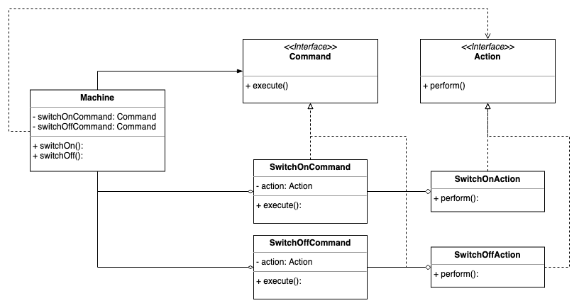
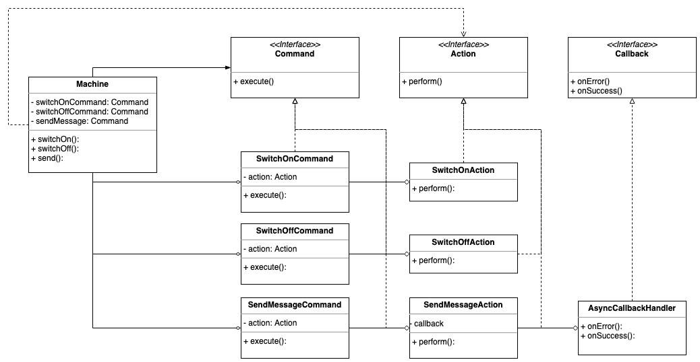

# Command Design Pattern

The **Command** pattern is one of the Behavioural Design Patterns and it's used to encapsulate information needed to perform
actions or trigger events. A usual application of this pattern lies around buttons in GUI systems, where the actions are decoupled
from the buttons objects for better reusability and separation of concerns.

On top of that, other applications are also common. For instance, parallel computing, asynchronous dispatch of events,
etc. For a more complete list, please check [here](https://en.wikipedia.org/wiki/Command_pattern).

## UML Diagram

This is a simplistic view of the **Command** design pattern class diagram, depicting how we could implement a machine with
switches to go on/off.

A more complete depict of the class diagram would decouple the commands' instances in the Machine class and instead have
them passed by an invoker object. For the sake of simplistic, lets stick to the one below:

## Implementation

You can find the implementation of the **Command** and **Action** interfaces under the [pattern.py](pattern.py)
and [action.py](action.py), respectively. The examples on how to use it can be found under the [examples](../../examples/command)
package, including an test application.

## Asynchronous calls with Callbacks

[*Welcome to the Callback Hell!*](http://callbackhell.com/)

Well, not really! We are not dealing with badly implemented callbacks. When you use a Callback Handler along with the Command
design pattern, the solution looks neat.

The idea behind this extension is to have an asynchronous call that send a message somewhere. Of course I'm not going to implement
a full message / subscriber mechanism. However, to show what the Callback handler could do, when combined with the **Command**
design pattern, it's interesting enough on its own. have a look at the extended version of our class diagram below:
 

I hope that this is enough to illustrate the use of the **Command** design pattern and also having it in combination with 
Callbacks. 