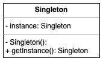

# Singleton Design Pattern

The Singleton design pattern is used to restrict the instantiation of a class to a single instance. But, what's the point
behind this idea? Imagine that you need to manage the access to a resource, to a single resource, through a whole system.
For instance, pun intended, you can access that same resources from multiple places, at any time. Any idea what it could be?

Thus, a good example of the Singleton design pattern is a Logging system. As you might be thinking now, if you have ever used
logging, which I hope you have, you know that you can just log stuff, as in information, warnings, errors, from everywhere
in your system. WHy that? Because the underlying implementation relies on the Singleton design pattern.

Fun fact, the Singleton name comes from the mathematical concept of a *unit set*, which is a set containing exactly one
element.   

# UML Diagram

That's probably the most complex UML diagram you have ever seen... but not! :D



As it is clearly depicted in the diagram above, the Singleton is defined by having an instance variable of itself and a
private constructor. To get a reference to that instance, one has to call the `getInstance()` method, which will then
check if the object has already been instantiated or not.

An important aspect to keep in mind is thread safety. For instance, depending on how complex the system using the Singleton
is, there might be multiple threads calling the `getInstance()` method. Make sure, if it is required, to synchronise that
access. 

# Implementation

You can find the implementation of the Singleton design pattern under the [pattern.py](pattern.py) file. It contains two
styles: defining it as a Python `type`, that can be used as a metaclass when being extended, and having a simple Singleton
class implementation. The latter is an example and would require you to repeat it for every Singleton class you would
need to create. The former uses a dictionary, as in a `Flyweight` fashion, to keep the references of instances already
created. We will see more about the Flyweight design patter in another place. 

## Simple Logger

To have a better idea about the Singleton design pattern can be used, I implemented a ridiculously simple Logger system. :)

The logger implementation uses the `SingletonType` as a metaclass. You can see how it is implemented in the [logging.py](../../examples/singleton/logging.py)
file. 

To demonstrate how it can be used, I have created a couple of Binary Search Tree cases, with Breadth and Depth first traversals,
that explore the `Logger` instance in a slightly extensive way. You can see it here: [bst_cases.py](../../examples/singleton/tests/bst_cases.py).

## Running the code

To run the `bst_cases.py`, from the root of the repository, do the following:

```shell script
python -m examples.singleton.tests.bst_cases
```